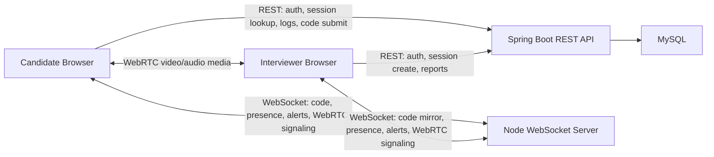

# InterviewShield Realtime Architecture

This document is an implementation blueprint. It describes the planned architecture only. It is not implemented yet.

## Target Architecture

- Spring Boot + MySQL: REST API and durable data.
- WebSocket: realtime control/data communication.
- WebRTC: 1-to-1 camera and microphone media.
- WebSocket carries WebRTC signaling.
- WebSocket carries live candidate-to-interviewer code synchronization.
- WebSocket carries presence and may carry live tab-switch alerts.
- Firebase realtime synchronization will be removed after replacement.
- Webcam snapshots will be removed after live video is working.
- Yjs/CRDT/OT should not be used unless multiple users need to edit the same document at the same time.

## A. WebSocket Message Protocol

All messages should be JSON objects with a shared envelope:

```json
{
  "type": "message_type",
  "sessionCode": "ABC123",
  "senderRole": "candidate",
  "senderId": "42",
  "payload": {}
}
```

Recommended shared fields:

- `type`: message type.
- `sessionCode`: interview session room.
- `senderRole`: `candidate` or `interviewer`.
- `senderId`: authenticated user id when available.
- `payload`: message-specific data.
- `messageId`: optional client-generated id for debugging/deduplication.
- `sentAt`: optional ISO timestamp for debugging.

### `join_session`

- Sender: candidate or interviewer.
- Receiver: WebSocket server.
- Purpose: register a socket into a session room.
- Required fields: `sessionCode`, `senderRole`, `senderId`.

```json
{
  "type": "join_session",
  "sessionCode": "ABC123",
  "senderRole": "candidate",
  "senderId": "42",
  "payload": {
    "token": "jwt-token-if-used"
  }
}
```

### `presence`

- Sender: server.
- Receiver: candidate and interviewer in the same session.
- Purpose: tell clients who is connected.
- Required fields: connected roles and ids.

```json
{
  "type": "presence",
  "sessionCode": "ABC123",
  "senderRole": "server",
  "senderId": "server",
  "payload": {
    "candidateConnected": true,
    "interviewerConnected": true,
    "candidateId": "42",
    "interviewerId": "7"
  }
}
```

### `code_snapshot`

- Sender: candidate.
- Receiver: interviewer.
- Purpose: send the full current document.
- Required fields: `content`, `version`.

```json
{
  "type": "code_snapshot",
  "sessionCode": "ABC123",
  "senderRole": "candidate",
  "senderId": "42",
  "payload": {
    "version": 12,
    "content": "function solve() {\n  return true;\n}"
  }
}
```

### `code_delta`

- Sender: candidate.
- Receiver: interviewer.
- Purpose: send incremental Monaco editor changes.
- Required fields: `version`, `previousVersion`, `changes`.

```json
{
  "type": "code_delta",
  "sessionCode": "ABC123",
  "senderRole": "candidate",
  "senderId": "42",
  "payload": {
    "previousVersion": 12,
    "version": 13,
    "changes": [
      {
        "range": {
          "startLineNumber": 1,
          "startColumn": 1,
          "endLineNumber": 1,
          "endColumn": 9
        },
        "text": "function",
        "rangeLength": 8
      }
    ]
  }
}
```

### `code_resync`

- Sender: interviewer.
- Receiver: candidate.
- Purpose: request a full document snapshot after reconnect or mismatch.
- Required fields: reason.

```json
{
  "type": "code_resync",
  "sessionCode": "ABC123",
  "senderRole": "interviewer",
  "senderId": "7",
  "payload": {
    "reason": "version_mismatch",
    "currentVersion": 10
  }
}
```

### `tab_switch`

- Sender: candidate.
- Receiver: interviewer, and optionally server-side logging path.
- Purpose: live alert that candidate left the tab.
- Required fields: `candidateId`, `occurredAt`, `count`.

```json
{
  "type": "tab_switch",
  "sessionCode": "ABC123",
  "senderRole": "candidate",
  "senderId": "42",
  "payload": {
    "candidateId": "42",
    "occurredAt": "2026-09-03T12:30:00.000Z",
    "count": 3
  }
}
```

### `webrtc_offer`

- Sender: call initiator, usually candidate or interviewer after both are present.
- Receiver: peer in same session.
- Purpose: begin WebRTC negotiation.
- Required fields: SDP offer.

```json
{
  "type": "webrtc_offer",
  "sessionCode": "ABC123",
  "senderRole": "candidate",
  "senderId": "42",
  "payload": {
    "sdp": {
      "type": "offer",
      "sdp": "..."
    }
  }
}
```

### `webrtc_answer`

- Sender: peer receiving offer.
- Receiver: offer creator.
- Purpose: answer WebRTC offer.
- Required fields: SDP answer.

```json
{
  "type": "webrtc_answer",
  "sessionCode": "ABC123",
  "senderRole": "interviewer",
  "senderId": "7",
  "payload": {
    "sdp": {
      "type": "answer",
      "sdp": "..."
    }
  }
}
```

### `webrtc_ice_candidate`

- Sender: candidate or interviewer.
- Receiver: peer in same session.
- Purpose: exchange ICE candidates.
- Required fields: ICE candidate.

```json
{
  "type": "webrtc_ice_candidate",
  "sessionCode": "ABC123",
  "senderRole": "candidate",
  "senderId": "42",
  "payload": {
    "candidate": {
      "candidate": "...",
      "sdpMid": "0",
      "sdpMLineIndex": 0
    }
  }
}
```

### `leave_session`

- Sender: candidate or interviewer.
- Receiver: server.
- Purpose: explicitly leave and clean up session state.
- Required fields: `sessionCode`, `senderRole`, `senderId`.

```json
{
  "type": "leave_session",
  "sessionCode": "ABC123",
  "senderRole": "candidate",
  "senderId": "42",
  "payload": {
    "reason": "page_unload"
  }
}
```

### `error`

- Sender: server.
- Receiver: client.
- Purpose: report invalid message, unauthorized role, room conflict, or routing failure.
- Required fields: `code`, `message`.

```json
{
  "type": "error",
  "sessionCode": "ABC123",
  "senderRole": "server",
  "senderId": "server",
  "payload": {
    "code": "unauthorized",
    "message": "Only the candidate may send code_delta."
  }
}
```

## Session Isolation

Every WebSocket connection must join exactly one `sessionCode` before sending session messages. The server must route messages only to sockets registered in the same session. Clients must not be allowed to choose a different `sessionCode` per message after registration.

## Candidate vs Interviewer Permissions

Candidate may send:

- `code_snapshot`
- `code_delta`
- `tab_switch`
- WebRTC signaling
- `leave_session`

Interviewer may send:

- `code_resync`
- WebRTC signaling
- `leave_session`

Server sends:

- `presence`
- `error`
- relayed peer messages

The interviewer should not be able to edit or broadcast code in the candidate-authoritative model.

## Message Ordering

The server should preserve socket receive order for each connection. Code messages should include versions so the interviewer can detect missed or out-of-order deltas.

If `code_delta.previousVersion` does not match the interviewer's current version, the interviewer should send `code_resync`.

## Reconnect Behavior

On reconnect:

1. Client opens a new WebSocket.
2. Client sends `join_session`.
3. Server updates presence.
4. Interviewer sends `code_resync`, or candidate proactively sends `code_snapshot`.
5. WebRTC renegotiates if the peer connection was lost.

## Duplicate Connections

For 1-to-1 sessions, the server should allow one active candidate socket and one active interviewer socket per session. If a second socket joins with the same role/user, prefer the newest connection and close or mark the older connection stale.

## Late Joins

If the interviewer joins after the candidate has started coding, the server should notify presence and the interviewer should request `code_resync`. The candidate responds with `code_snapshot`.

If the candidate joins after the interviewer, the candidate should send an initial `code_snapshot` after the editor mounts.

## B. Live Code Synchronization

The model should be candidate-authoritative:

- Candidate is the only active editor.
- Interviewer receives a read-only Monaco mirror.
- Candidate sends full document snapshots on join, reconnect, and resync.
- Candidate sends Monaco incremental changes during normal editing.
- Interviewer applies deltas only when versions match.
- Interviewer requests `code_resync` when versions do not match.

Recommended version model:

- Candidate starts with version `0`.
- Each Monaco change batch increments the version by `1`.
- `code_delta` includes `previousVersion` and `version`.
- `code_snapshot` includes the full `content` and latest `version`.

This avoids CRDT/OT complexity. CRDTs are only needed if both candidate and interviewer, or multiple candidates, must edit the same document concurrently.

## C. WebRTC Design

WebRTC is responsible for video/audio only. WebSocket carries signaling only.

Frontend flow:

1. Ask for media:

```js
navigator.mediaDevices.getUserMedia({ video: true, audio: true })
```

2. Attach local stream to local video.
3. Create `RTCPeerConnection`.
4. Add local tracks to the peer connection.
5. Send offer through WebSocket.
6. Receive answer through WebSocket.
7. Exchange ICE candidates through WebSocket.
8. Attach remote tracks to remote video.

Cleanup:

- Stop all local media tracks.
- Remove event handlers.
- Close `RTCPeerConnection`.
- Close or unregister WebSocket session.
- Clear local/remote video refs.

Permission failure:

- Show a clear UI message.
- Keep the interview page usable if possible.
- Do not repeatedly prompt in a loop.

Reconnect/failure:

- Watch `connectionState` and `iceConnectionState`.
- If failed/disconnected, close the old peer connection and renegotiate.
- Require a fresh `code_snapshot` after WebSocket reconnect.

STUN/TURN:

- Local development can start with a public STUN server or no custom ICE config for same-network tests.
- Production should configure STUN.
- Production will eventually need TURN for restrictive NAT/firewall environments.
- TURN credentials should come from environment/config, not source code.

## D. Shared Realtime Server

Recommended room structure:

```text
sessionCode
  candidate connection
  interviewer connection
```

Server responsibilities:

- Accept WebSocket connections.
- Validate `join_session`.
- Register socket by `sessionCode` and role.
- Route messages only within the same session.
- Enforce role permissions.
- Broadcast `presence`.
- Clean up on disconnect or `leave_session`.
- Reject cross-session messages.
- Optionally call or coordinate with REST logging for durable events later.

The server must not carry video or audio bytes.

## E. Frontend Structure

Keep the structure small and understandable:

- `src/realtime/realtimeClient.js`
  - WebSocket connect/send/receive/reconnect.
- `src/realtime/messages.js`
  - Message type constants and small builders.
- `src/hooks/useRealtimeSession.js`
  - Join/leave session and presence state.
- `src/hooks/useLiveCodeSync.js`
  - Candidate sends snapshots/deltas.
  - Interviewer applies read-only updates.
- `src/hooks/useWebRTCCall.js`
  - Local media, peer connection, signaling, remote stream, cleanup.
- `src/hooks/useTabSwitchAlert.js`
  - REST log plus optional WebSocket live alert.
- `src/components/VideoCallPanel.jsx`
  - Local and remote video display.
- `src/components/ConnectionStatus.jsx`
  - Realtime/presence state.

Avoid a large framework-like abstraction. The first version only needs one candidate and one interviewer.

## F. Backend / Server Structure Recommendation

For this project, start with a separate Node WebSocket server, replacing the current `app/ws-server.js`.

Why:

- The project already has a Node frontend workspace and `ws` dependency.
- WebRTC signaling and code relay are lightweight.
- It avoids adding Spring WebSocket complexity before the architecture is proven.
- The realtime server can stay simple and easy to inspect.

Tradeoff:

- Auth/session validation is easier to centralize inside Spring Boot.
- If production deployment needs one backend service, moving WebSocket into Spring Boot later may be cleaner.

Recommendation:

- Phase 1: use a simple Node `ws` server.
- Phase 2: if deployment/auth becomes painful, move realtime into Spring Boot.

The existing `app/ws-server.js` currently uses `y-websocket` and was likely intended for collaborative editing. Since the agreed design does not use Yjs, it should eventually be replaced or deleted.

## G. Migration Plan

1. Realtime protocol/server
   - Define message types first.
   - Replace current Yjs-style `ws-server.js` with a simple room router.

2. Frontend WebSocket client
   - Add one shared connection wrapper.
   - Handle join, leave, reconnect, send, and receive.

3. Live-code synchronization
   - Candidate sends initial `code_snapshot`.
   - Candidate sends `code_delta`.
   - Interviewer applies deltas to read-only Monaco.
   - Add `code_resync` fallback.
   - Keep Firebase temporarily until WebSocket sync is verified.

4. Realtime alerts
   - Send `tab_switch` through WebSocket.
   - Continue REST persistence for reports.
   - Remove Firebase alerts after parity.

5. WebRTC signaling
   - Add offer/answer/ICE message routing.
   - Verify signaling before building polished video UI.

6. Video/audio UI
   - Add local and remote video panels.
   - Add permission, loading, connected, and failed states.

7. Remove snapshots
   - Stop snapshot interval.
   - Stop writing `WEBCAM_SNAPSHOT` logs.
   - Remove snapshot UI from reports.

8. Remove Firebase
   - Remove Firebase code sync and alert listeners.
   - Remove Firebase config after no references remain.

9. Remove unused Yjs/WebSocket dependencies/code
   - Remove Yjs-related dependencies if unused.
   - Delete or replace old `ws-server.js` once the new server exists.

10. Update reports/risk logic
   - Remove snapshot count from report.
   - Revisit risk score formula.
   - Keep response shape as stable as possible.

11. Tests and cleanup
   - Add backend tests for report changes.
   - Manually verify realtime browser flows.
   - Add focused frontend tests only for extracted pure logic where practical.

Dependencies:

- WebSocket protocol must exist before code sync or signaling.
- Code sync should migrate before Firebase removal.
- WebRTC signaling must exist before live video can work.
- Snapshot removal should happen only after video/audio is usable.
- Report/risk changes should happen after snapshot removal.

## H. Risks and Handling

- Reconnects: reconnect WebSocket, rejoin session, refresh presence, request code snapshot, renegotiate WebRTC if needed.
- Stale code: use document versions and `code_resync`.
- Duplicate sockets: keep one active connection per role/session; prefer newest connection.
- Browser permissions: show clear permission failure state and stop retry loops.
- NAT/firewall problems: use STUN for development/prototype; plan TURN for production.
- TURN: use environment-provided TURN URLs and credentials.
- React StrictMode: guard effects so duplicate WebSocket and WebRTC setup does not persist in development.
- Session isolation: bind each socket to one session after join and reject cross-session messages.
- Cleanup: close sockets, close peer connections, stop media tracks, unregister listeners.
- Server crashes/restarts: clients should reconnect and request full code resync; WebRTC calls may need renegotiation.

## Architecture Diagram


